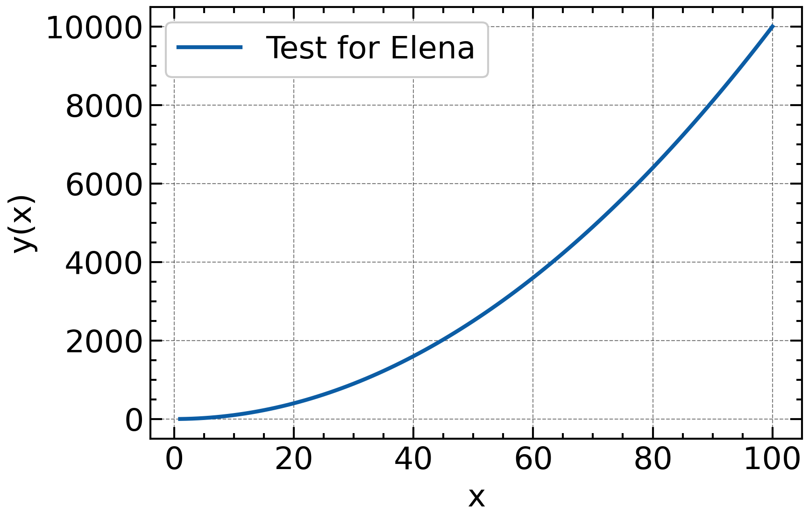

# test_repos

### Science plots
To create more professional looking plots, you can try to use scienceplots
- Automatically adds grid lines
- Using latex for the labels

`import numpy as np import matplotlib.pyplot as plt import scienceplots plt.style.use(['science','notebook','grid']) plt.rcParams["figure.figsize"]=(6,4)`

For example:

